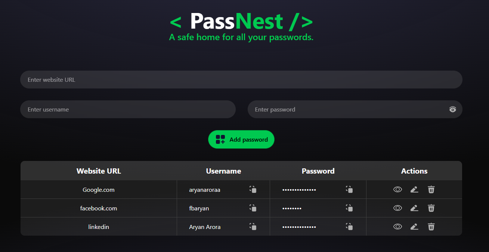

# PassNest — Dockerized Application with CI/CD

PassNest is a full-stack password manager that I containerized and deployed using **Docker, Docker Compose, Nginx, MongoDB, AWS EC2, Docker Hub, and GitHub Actions**.

The main goal of this project was to gain hands-on experience with containerization, Docker networking, reverse proxies, cloud deployment, and automating deployments through a CI/CD pipeline.

## Table of Contents

- [Project Overview](#project-overview)
- [Demo](#demo)
- [Architecture](#architecture)
- [Tech Stack](#tech-stack)
- [Project Structure](#project-structure)
- [Features and What This Project Demonstrates](#features-and-what-this-project-demonstrates)
- [Prerequisites](#prerequisites)
- [Run Locally with Docker Compose](#run-locally-with-docker-compose)
- [Useful Docker Commands](#useful-docker-commands)
- [CI/CD Pipeline](#cicd-pipeline)
- [AWS EC2 Deployment](#aws-ec2-deployment)
- [What I Learned](#what-i-learned)
- [Challenges and Solutions](#challenges-and-solutions)
- [Security Considerations](#security-considerations)
- [Future Improvements](#future-improvements)

## Project Overview

PassNest was used as the application for building and practising a containerized deployment workflow.

The application is divided into four services:

1. **Frontend** — React application served by Vite.
2. **Backend** — Node.js and Express REST API.
3. **MongoDB** — stores application data.
4. **Nginx** — reverse proxy and single public entry point.

Docker Compose manages the services and their network. GitHub Actions automates image building, publishing, and deployment to an AWS EC2 instance.

## Demo (Click the preview to watch the demo.)

[](YOUR_VIDEO_URL)

The demo showcases the application running with Docker Compose, Nginx reverse proxying, MongoDB persistence, and automated deployment to AWS EC2 using GitHub Actions.

## Architecture

### Application architecture

```text
                    User's Browser
                          |
                          v
                     Nginx :80
                     /        \
                    v          v
              Frontend       /api/
              :5173            |
                               v
                           Backend
                            :3000
                               |
                               v
                           MongoDB
                            :27017
```

Nginx routes normal web requests to the frontend and API requests through `/api/` to the backend. The backend communicates with MongoDB using the Docker Compose service name.

### CI/CD architecture

```text
Developer pushes code to GitHub
               |
               v
        GitHub Actions
               |
       Build and validate
               |
               v
        Build Docker images
               |
               v
          Docker Hub
               |
               v
        SSH into AWS EC2
               |
               v
       Pull latest Git changes
               |
               v
        Pull Docker images
               |
               v
      Recreate application stack
```

## Tech Stack

| Category | Technologies |
|---|---|
| Frontend | React, Vite, Tailwind CSS |
| Backend | Node.js, Express |
| Database | MongoDB |
| Containerization | Docker, Docker Compose |
| Reverse proxy | Nginx |
| Image registry | Docker Hub |
| Cloud hosting | AWS EC2 |
| CI/CD | GitHub Actions |
| Version control | Git, GitHub |

## Project Structure

```text
my-app-mongo/
├── backend/
│   ├── Dockerfile
│   ├── .dockerignore
│   ├── package.json
│   └── server.js
├── nginx/
│   └── default.conf
├── public/
├── src/
│   ├── components/
│   │   ├── Manager.jsx
│   │   └── Navbar.jsx
│   ├── App.jsx
│   └── main.jsx
├── .github/
│   └── workflows/
│       └── deploy.yml
├── Dockerfile
├── .dockerignore
├── docker-compose.yml
├── package.json
├── vite.config.js
└── README.md
```

*The exact repository structure may vary slightly as the project evolves.*

## Features and What This Project Demonstrates

- Containerizing a frontend and backend separately.
- Running multiple services with Docker Compose.
- Connecting containers through a Docker network.
- Persisting MongoDB data with a named Docker volume.
- Routing frontend and API traffic through Nginx.
- Building and publishing Docker images to Docker Hub.
- Automating builds and deployments using GitHub Actions.
- Deploying a containerized application to AWS EC2 over SSH.
- Updating the application and its configuration through an automated deployment workflow.

## Prerequisites

To run the project locally, you need:

- [Git](https://git-scm.com/)
- [Docker Desktop](https://www.docker.com/products/docker-desktop/) on Windows/macOS, or Docker Engine on Linux
- Docker Compose (included with current Docker Desktop installations and available as a Docker Compose plugin on Linux)
- An internet connection to clone the repository and pull images

You do not need to install Node.js or MongoDB directly on your computer when using the provided Docker Compose setup.

## Run Locally with Docker Compose

### 1. Clone the repository

```bash
git clone https://github.com/aryan-aroraa/passnest-docker-cicd.git
cd passnest-docker-cicd
```

### 2. Start the application

```bash
docker compose up -d
```

Docker Compose starts the frontend, backend, MongoDB, and Nginx services.

### 3. Check the containers

```bash
docker compose ps
```

Verify that the four services are running.

### 4. Open the application

Visit:

```text
http://localhost
```

Nginx is the main entry point at `http://localhost`. The current Compose file also publishes ports `5173`, `3000`, and `27017` on the host for the frontend, backend, and MongoDB respectively.

### 5. Test persistence

Add a test entry, refresh the page, and verify that the entry remains available. This checks that the frontend, API, and database are communicating correctly.

### 6. Stop the application

```bash
docker compose down
```

This stops and removes the Compose containers and network. The named MongoDB volume is retained by default, so the database data can survive container recreation.

**Note:** Avoid `docker compose down -v` unless you intentionally want to remove the associated named volumes and their stored data.

## Useful Docker Commands

View running services:

```bash
docker compose ps
```

View logs from all services:

```bash
docker compose logs
```

Follow logs in real time:

```bash
docker compose logs -f
```

View logs from a particular service:

```bash
docker compose logs -f backend
```

Restart a service:

```bash
docker compose restart nginx-server
```

Recreate the application containers:

```bash
docker compose up -d --force-recreate
```

Stop the stack:

```bash
docker compose down
```

## CI/CD Pipeline

The GitHub Actions workflow automates the deployment process when code is pushed to the configured branch.

The workflow performs the following steps:

1. Checks out the repository.
2. Sets up Node.js.
3. Installs frontend dependencies and runs lint/build checks.
4. Installs backend dependencies.
5. Builds frontend and backend Docker images.
6. Authenticates with Docker Hub using GitHub Actions secrets and variables.
7. Pushes the images to Docker Hub.
8. Connects to EC2 over SSH.
9. Pulls the latest repository changes.
10. Pulls the latest Docker images.
11. Recreates the application containers using Docker Compose.

The deployment uses commands equivalent to:

```bash
git pull origin main
docker compose pull
docker compose up -d --force-recreate
```

The repository update is important because the deployment includes configuration files such as `docker-compose.yml` and `nginx/default.conf`, not just Docker images.

### Required GitHub Actions configuration

The workflow uses GitHub Actions variables/secrets for deployment configuration, including:

- `DOCKER_USERNAME` — Docker Hub username.
- `DOCKER_TOKEN` — Docker Hub access token.
- `EC2_HOST` — EC2 public or Elastic IP.
- `EC2_SSH_KEY` — private SSH key used for deployment.

Configure these in your repository's **Settings → Secrets and variables → Actions**. Never commit secret values or private keys to the repository.

## AWS EC2 Deployment

The application can be deployed to an Ubuntu EC2 instance. In this project, GitHub Actions builds and pushes the Docker images to Docker Hub, then connects to EC2 over SSH to update and recreate the running services.

### Prerequisites

- An AWS account.
- An Ubuntu EC2 instance with enough resources to run the four services.
- Docker Engine, the Docker Compose plugin, and Git installed on the instance.
- An SSH key that allows you to connect to the instance.
- A configured EC2 Security Group.
- The frontend and backend images available in public Docker Hub repositories.
- GitHub Actions enabled for the repository.

### Initial EC2 setup

1. Launch an Ubuntu EC2 instance and configure SSH access from your own trusted IP address.
2. Install Docker Engine, the Docker Compose plugin, and Git using the official instructions for your Ubuntu version.
3. Connect to the instance over SSH.
4. Clone the repository and enter the project directory:

   ```bash
   git clone https://github.com/aryan-aroraa/passnest-docker-cicd.git
   cd passnest-docker-cicd
   ```

5. Start the stack:

   ```bash
   docker compose up -d
   docker compose ps
   ```

6. Open `http://<EC2-PUBLIC-IP>` in your browser, replacing the placeholder with the instance's public IP address.

### Security Group and ports

The current Compose file publishes these host ports:

| Port | Service | Purpose |
|---|---|---|
| `80` | Nginx | Main application entry point |
| `5173` | Frontend | Vite development server |
| `3000` | Backend | Express API |
| `27017` | MongoDB | Database |

Although the Compose file publishes all four ports on the EC2 host, **do not allow public inbound access to all of them in the EC2 Security Group**. For a basic demo, allow HTTP on port `80` and restrict SSH (port `22`) to your own trusted IP. Do not expose MongoDB to the public internet. The frontend uses `/api/` through Nginx, so visitors can use the app through port `80`.

### Configure GitHub Actions

In your GitHub repository, open **Settings → Secrets and variables → Actions** and configure the following values used by the workflow:

| Name | Type | Purpose |
|---|---|---|
| `DOCKER_USERNAME` | Variable | Docker Hub username |
| `DOCKER_TOKEN` | Secret | Docker Hub access token |
| `EC2_HOST` | Secret | EC2 public or Elastic IP address |
| `EC2_SSH_KEY` | Secret | Private SSH key used by the deployment workflow |

Never commit the token, private key, or other credentials to the repository.

The EC2 instance must have the repository cloned in the directory expected by the workflow. The deployment script runs commands equivalent to:

```bash
cd passnest-docker-cicd
git pull origin main
docker compose pull
docker compose up -d --force-recreate
```

When code is pushed to the branch configured in the workflow, GitHub Actions builds and pushes the frontend and backend images, connects to EC2 over SSH, pulls the latest repository changes and images, and recreates the services.

### Important notes

- The exact branch that triggers deployment is defined in `.github/workflows/deploy.yml`.
- The current workflow uses the `latest` image tag; deployments therefore pull the latest published images rather than a version-pinned release.
- If the EC2 instance is stopped, the application will be unavailable until the instance is started again.
- For a real production service, use HTTPS, review the exposed ports, and add appropriate authentication, encryption, monitoring, backups, and deployment safeguards.
## What I Learned

### Docker and Docker Compose

- Writing Dockerfiles and building images.
- Running and inspecting containers.
- Connecting services through Docker networks.
- Using named volumes for database persistence.
- Understanding the difference between an image, a container, and source code.
- Understanding the difference between container ports and published host ports.

### Nginx and networking

- Configuring Nginx as a reverse proxy.
- Routing requests to separate frontend and backend services.
- Using Docker Compose service names for internal communication.
- Understanding why `localhost` in browser-side JavaScript refers to the user's computer rather than a remote EC2 instance.
- Routing API requests through a same-origin `/api/` endpoint.

### CI/CD and AWS

- Creating GitHub Actions workflows.
- Building and publishing Docker images automatically.
- Managing deployment secrets and variables.
- Deploying to EC2 through SSH.
- Updating remote repository files and images during deployment.
- Understanding why a successful pipeline does not necessarily guarantee that the running application works correctly.

## Challenges and Solutions

### 1. MongoDB image and data compatibility

**Problem:** Switching MongoDB versions caused a compatibility issue with an existing local database volume.

**Solution:** Used a compatible MongoDB image version and recreated the local volume when its stored feature compatibility version was incompatible.

**Lesson:** Database volumes contain persistent state and must be considered when changing database versions. Recreating a volume deletes its stored data, so this should only be done when that data can be discarded or has been backed up.

### 2. Backend could not resolve MongoDB

**Problem:** The backend attempted to connect to an incorrect MongoDB hostname.

**Solution:** Used the Docker Compose service name, `mongo`, as the database hostname.

**Lesson:** Containers on the same Compose network can resolve services by their service names.

### 3. Updated source code was missing from a Docker image

**Problem:** Changes to the backend source were not reflected in the running container.

**Solution:** Rebuilt the backend image and recreated the backend container.

**Lesson:** Editing a source file does not automatically update an image that was already built.

### 4. Vite host restrictions behind Nginx

**Problem:** The frontend initially rejected requests coming through the Docker/Nginx setup.

**Solution:** Adjusted the Vite server configuration and rebuilt the frontend image.

**Lesson:** Container configuration changes must reach the image or running service that uses them.

### 5. API requests used the wrong `localhost`

**Problem:** The frontend loaded through Nginx, but API requests were sent to `localhost:3000` from the browser.

**Solution:** Changed the frontend to call `/api/` and configured Nginx to proxy those requests to `backend:3000`.

**Lesson:** Browser-side JavaScript runs on the user's computer. It cannot use Docker-only service names to reach containers.

### 6. EC2 kept an outdated Nginx configuration

**Problem:** The deployment pipeline succeeded, but the EC2 Nginx container still used the previous configuration.

**Solution:** Updated the deployment workflow to pull repository changes and recreate the containers.

**Lesson:** Deployment must update both application images and the configuration files used to run them.

### 7. Local and remote deployment behaved differently

**Problem:** The application worked locally but did not initially work correctly after deployment.

**Solution:** Checked container status, logs, Nginx configuration, browser Network requests, and the deployment workflow to isolate the cause.

**Lesson:** Debugging the full request path is more reliable than assuming that a successful image build means the whole application is working.

## Security Considerations

This project is intended as a learning and portfolio project. **Do not use it as-is to store real sensitive passwords.**

Before treating a password manager as production-ready, additional security measures would be required, including:

- Strong authentication and authorization.
- Proper encryption of stored passwords.
- HTTPS/TLS.
- Database authentication and restricted access.
- Secure secret management.
- Backups and recovery procedures.
- Input validation and security testing.
- Restricted inbound network access.
- Production-ready logging and monitoring.

Do not commit `.env` files, private SSH keys, tokens, or other secrets.

## Future Improvements

Possible improvements include:

- HTTPS using a domain and TLS certificates.
- Replacing the Vite development server with a production frontend build.
- Using immutable Docker image tags instead of relying only on `latest`.
- Adding health checks and improved service startup handling.
- Adding automated tests to the CI pipeline.
- Adding image vulnerability scanning.
- Implementing safer deployment and rollback strategies.
- Improving secret management, monitoring, and backups.
- Exploring Infrastructure as Code using Terraform or AWS CloudFormation.

---

## Disclaimer

PassNest is a learning project created to practise Docker, Docker Compose, Nginx, AWS EC2, and CI/CD concepts. It is not intended to be used as a production password manager.
